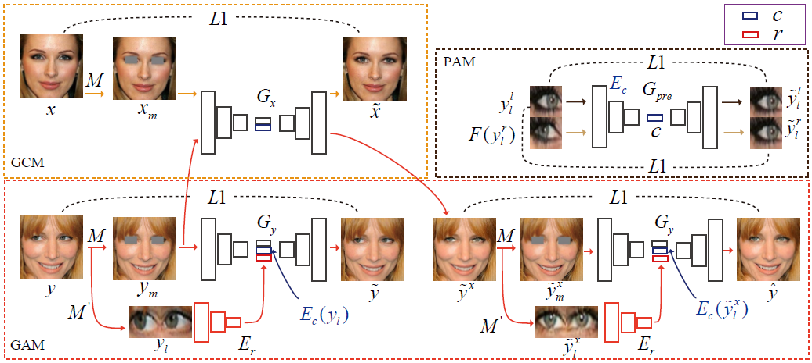
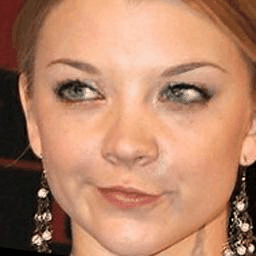

## GazeAnimation - Official Tensorflow Implementation

<p align="center"></p>

> ***A Dual In-painting Model for Unsupervised Gaze Correction and Animation in the Wild***<br>
> Jichao Zhang, Jingjing Chen, [Hao Tang](https://ha0tang.github.io/), [Wei Wang](https://weiwangtrento.github.io/), [Yan Yan](https://userweb.cs.txstate.edu/~y_y34/), [Enver Sangineto](https://disi.unitn.it/~enver.sangineto/index.html), [Nicu Sebe](http://disi.unitn.it/~sebe/)<br>
> In ACMMM 2020.<br>

> Paper: https://arxiv.org/abs/1805.07509<br>

> **Abstract:** In this paper, we address the problem of unsupervised gaze correction in the wild that works without the need for precise annotations of the gaze angle and head pose. We have created a new NewGaze dataset which consists of two domains X, Y in which eyes are either staring at the camera or somewhere else. Our method consists of three novel modules: Gaze Correction module~(GCM), Gaze Animation module~(GAM), and Pretrained Autoencoder module~(PAM). Specifically, GCM and GAM separately trains a dual in-painting model using data from domain X for gaze correction and data from domain Y for gaze animation. Additionally, a Synthesis-As-Training method is proposed when training GAM to encourage the features encoded from the eye region to be correlated with the angle information, resulting in gaze animation can be achieved by interpolation in the latent space. 
To further preserve the identity information~(e.g., eye shape, iris color), we propose the PAM with an Autoencoder by Self-Supervised mirror learning whose bottleneck features are angle-invariant and work as an extra input to the dual in-painting models. Extensive experiments validate the effectiveness of our model in gaze correction and gaze animation in the wild and demonstrate the superiority of our method in producing more compelling results than state-of-the-art baselines..*

### Citation

```
@inproceedings{zhang2018sparsely,
  title={Sparsely grouped multi-task generative adversarial networks for facial attribute manipulation},
  author={Zhang, Jichao and Shu, Yezhi and Xu, Songhua and Cao, Gongze and Zhong, Fan and Liu, Meng and Qin, Xueying},
  booktitle={Proceedings of the 26th ACM international conference on Multimedia},
  pages={392--401},
  year={2018}
}
```

## Network Architecture



## Dependencies

```bash
Python=3.6
pip install -r requirments.txt

```
Or Using Conda

```bash
-conda create -name GazeA python=3.6
-conda install tensorflow-gpu=1.9
```
Other packages installed by pip.

## Usage

- Clone this repo:
```bash
git clone https://github.com/zhangqianhui/GazeAnimation.git
cd GazeAnimation

```

- Download the NewGaze dataset

  Download the tar of NewGaze dataset from [Google Driver Linking](https://drive.google.com/open?id=1lYzpKdShN68RJGxRF1JgXnW-ved0F-mJ).
  
  ```bash
  cd your_path
  tar -xvf NewGazeData.tar
  ```
  
  Please edit the options.py and change your dataset path

- Pretraining Model

You can edit label_dir and data_dir

- Train the model using command line with python 
```bash
python train.py --exper_name='log20_5_1' --gpu_id='0' --loss_type='wgan_gp' --n_critic=5 --lam_c=10
```
- Test the model
```bash
python test.py --exper_name='log20_5_1' --gpu_id='0' 
```

Or Using scripts for training 
```bash
bash scripts/train_log20_5_1.sh
```
Using scripts for testing and pretained model can be downloaded [Pretrained Model](https://drive.google.com/file/d/1GYyGGQm06ahI0V4mBzSCaT1Fh4kzHb76/view?usp=sharing) 
```bash
bash scripts/test_log20_5_1.sh
```

## Experiment Result 

### Gaze Correction

<p align="center"></p>


### Gaze Animation

 



# Related Work

- [Sparsely_Grouped_GAN](https://github.com/zhangqianhui/Sparsely-Grouped-GAN)

- [GazeCorrection](https://github.com/zhangqianhui/GazeCorrection)

